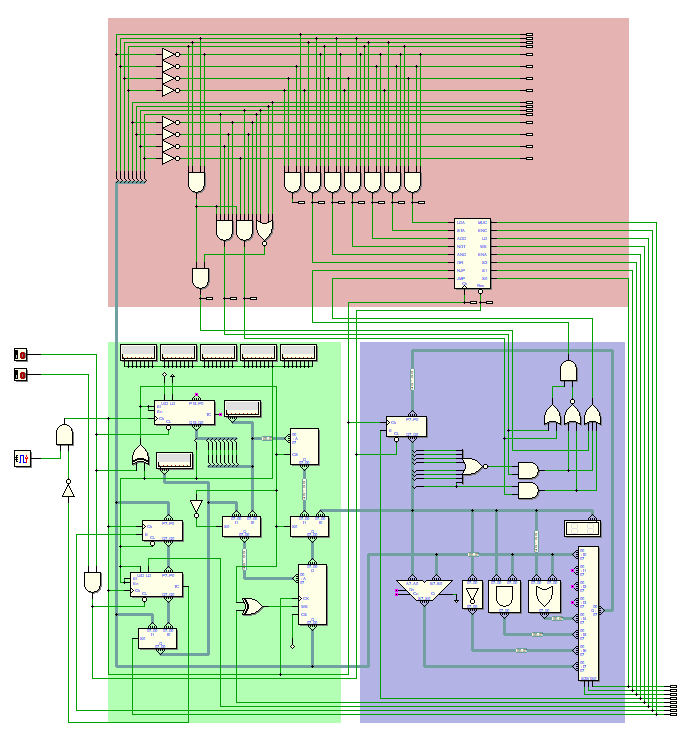

# Processador Programável de 8 bits

Projeto pessoal desenvolvido no simulador de eletrônica digital **Deeds** com o objetivo de estudar, projetar e implementar a arquitetura de um processador programável de 8 bits.

A arquitetura foi desenvolvida a partir de componentes digitais básicos e inclui **unidade de controle, unidade lógica e aritmética (ULA), registrador acumulador, memória ROM/RAM e contador de programa**, permitindo a execução de um conjunto próprio de instruções.

🎥 **Vídeo demonstrativo e simulação:**  [clique aqui](https://www.youtube.com/watch?v=KcWQU9CIYoI&t=136s)  

<!--

-->

 

<b>Estrutura do processador</b>
 

<!-- 
<table>
  <tr>
    <td>
      <pre><code class="language-js">
        
      Inicialização e carregamento ROM → RAM

    

      
      Durante essa etapa, multiplexadores selecionam:
      -    O contador de carregamento como fonte do barramento de endereços;
      -    A ROM como fonte do barramento de dados utilizado para escrita na RAM.
      
      Ao atingir o final da região de memória a ser copiada, o contador de carregamento gera uma flag indicando a conclusão 
      da inicialização. Essa flag intertrava os circuitos responsáveis pelo carregamento e altera o origem do barramento de 
      endereço e dados da RAM através de multiplexadores, transferindo o controle do sistema para o próprio processador:
      
      O barramento de endereços passa a ser controlado pelo Contador de programa (PC);
      o caminho de dados deixa de ser alimentado pela ROM e passa a utilizar o datapath da ULA.
      
      A partir desse momento, o processador encontra-se pronto para entrar no estado de execução.
      
      **Execução do programa**
      
      O segundo botão permite iniciar a execução do programa previamente carregado na RAM.
      
      Com o contador de programa liberado, o PC passa a percorrer os endereços da RAM e a Unidade de Controle realiza o 
      ciclo de busca, decodificação e execução das instruções.
      
      De forma simplificada
      
      </code></pre>              
  </tr>
</table>

-->

## Arquitetura

A arquitetura foi dividida em três blocos principais, destacados por cores no diagrama:

- 🔴 **Unidade de Controle:** Responsável pela decodificação das instruções e pelo controle dos diferentes estados necessários à execução de cada operação;
- 🔵 **Unidade Lógica e Aritmética (ULA):** Executa operações aritméticas e lógicas e atualiza as flags utilizadas pelas instruções de salto condicional;
- 🟢 **Memória e controle de fluxo:** Composto pelas memórias ROM e RAM e pelo contador de programa (*Program Counter — PC*), responsáveis pelo armazenamento e sequenciamento das instruções.

A arquitetura utiliza um único registrador de propósito geral, empregado como acumulador.

## Funcionamento

Ao ligar o processador pelo botão "ligar", o programa armazenado na **ROM** é transferido para a **RAM** através de um circuito dedicado de inicialização.

Ao acionar o botão Ligar, um contador de carregamento independente do contador de programa percorre sequencialmente 
os endereços da ROM e da RAM simultaneamente. A cada ciclo, o conteúdo lido é transferido para o endereço correspondente da RAM.

Após o acionamento do comando de execução, o processador inicia o ciclo de processamento das instruções armazenadas na RAM:

1. o contador de programa indica o endereço da próxima instrução;
2. a instrução é lida da memória;
3. a unidade de controle decodifica o opcode;
4. os sinais de controle necessários são gerados;
5. a ULA, os registradores ou a memória executam a operação;
6. o contador de programa é atualizado para a próxima instrução ou alterado por uma instrução de salto.

Esse processo se repete durante toda a execução do programa.

## Conjunto de instruções

O processador utiliza um conjunto próprio de instruções (*Instruction Set Architecture — ISA*).

Os programas podem ser representados por mnemônicos em **Assembly**, que posteriormente correspondem aos respectivos opcodes utilizados pelo processador em código de máquina.

| Instrução | Código de máquina | Descrição |
| :--- | :---: | :--- |
| `LDA` | `[0x10][0xXX]` | Carrega no acumulador o conteúdo do endereço de memória `X`. |
| `STA` | `[0x20][0xXX]` | Armazena o conteúdo do acumulador no endereço de memória `X`. |
| `ADD` | `[0x30][0xXX]` | Soma ao acumulador o conteúdo do endereço de memória `X`. |
| `NOT` | `[0x40]` | Realiza a inversão bit a bit do conteúdo do acumulador. |
| `AND` | `[0x50][0xXX]` | Realiza uma operação AND bit a bit entre o acumulador e o conteúdo do endereço `X`. |
| `OR` | `[0x60][0xXX]` | Realiza uma operação OR bit a bit entre o acumulador e o conteúdo do endereço `X`. |
| `JMP` | `[0x70][0xXX]` | Altera incondicionalmente o fluxo de execução para o endereço `X`. |
| `JZ` | `[0x71][0xXX]` | Salta para o endereço `X` quando a flag de zero está ativa. |
| `JN` | `[0x72][0xXX]` | Salta para o endereço `X` quando a flag de negativo está ativa. |

`0xXX` representa o endereço de memória utilizado como operando pela instrução.

## Objetivos do projeto

O projeto foi desenvolvido como exercício de aprofundamento em:

- arquitetura de computadores;
- eletrônica digital;
- máquinas de estados;
- projeto de unidade de controle;
- funcionamento de memória e registradores;
- desenvolvimento de uma ISA própria;
- fluxo de dados entre os diferentes blocos de um processador;
- execução de instruções em código de máquina.

